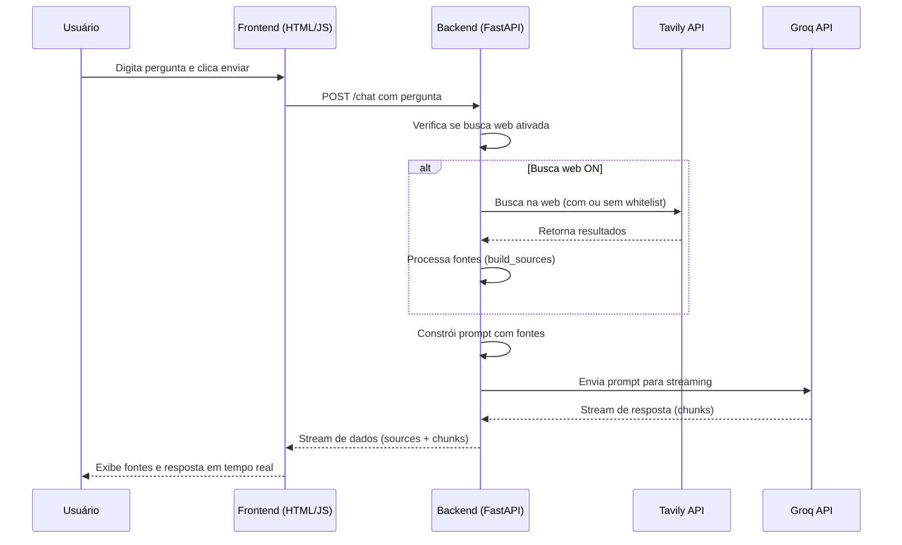

# Busca IA

## Visão Geral

**Busca IA** é uma aplicação web inteligente que permite aos usuários fazer perguntas e receber respostas baseadas em pesquisa em tempo real na web. A aplicação combina busca na internet usando a API Tavily com geração de respostas via Groq (modelo LLaMA 3.3), oferecendo um assistente de pesquisa conversacional.

## Diagrama de Arquitetura e Fluxo



Este diagrama de sequência ilustra o fluxo principal da aplicação: desde a entrada do usuário até a exibição da resposta, destacando a integração com as APIs externas Tavily e Groq.

## Funcionalidades Principais

- **Busca Web em Tempo Real**: Pesquisa na web usando Tavily para obter informações atualizadas.
- **Respostas Inteligentes**: Geração de respostas estruturadas em português brasileiro usando IA (Groq).
- **Whitelist de Domínios Confiáveis**: Opção para restringir buscas a sites confiáveis (Globo, Folha, ESPN, etc.).
- **Interface Conversacional**: Chat-like com streaming de respostas.
- **Citações e Fontes**: Exibe fontes com ícones de favicon, títulos e domínios, com citações inline nas respostas.
- **Renderização Markdown**: Respostas formatadas com suporte a negrito, listas, código, etc.
- **Controles de Configuração**: Botões para ativar/desativar busca web e whitelist via interface.

## Como Funciona

### Arquitetura

A aplicação é construída com:
- **Backend**: FastAPI (Python) para APIs REST e streaming.
- **Frontend**: HTML/CSS/JavaScript puro com Jinja2 para templates.
- **APIs Externas**:
  - **Tavily**: Para busca web (até 1000 buscas/mês grátis).
  - **Groq**: Para geração de respostas (modelo LLaMA 3.3-70b-versatile).

### Fluxo de Funcionamento

1. **Entrada do Usuário**: O usuário digita uma pergunta na interface web.
2. **Busca Web (Opcional)**: Se a busca web estiver ativada, a aplicação consulta a API Tavily.
   - Se whitelist estiver ativa, busca apenas em domínios confiáveis.
   - Se a busca restrita não retornar resultados, faz fallback para busca aberta.
3. **Construção do Prompt**: Monta um prompt para o Groq incluindo a pergunta e snippets das fontes encontradas.
4. **Geração de Resposta**: Envia o prompt para Groq via streaming, exibindo a resposta em tempo real.
5. **Exibição**: Mostra a resposta formatada, fontes citadas e links para as origens.

### Endpoints da API

- `GET /`: Página principal (interface web).
- `POST /chat`: Envia pergunta e recebe resposta em streaming.
- `POST /toggle_web`: Liga/desliga busca web.
- `POST /toggle_whitelist`: Liga/desliga restrição de domínios.
- `GET /whitelist`: Lista domínios confiáveis.
- `GET /status`: Status da aplicação e configurações.

### Configurações

- **Chaves de API**: Configuradas diretamente no código (Groq e Tavily).
- **Whitelist**: Lista de domínios confiáveis (editável no código).
- **Modelo Groq**: LLaMA 3.3-70b-versatile.
- **Parâmetros**: Temperatura 0.7, max_tokens 1024.

## Instalação e Execução

### Pré-requisitos

- Python 3.8+
- Chaves de API válidas para Groq e Tavily.

### Passos

1. **Clone o repositório** (ou baixe os arquivos):
   ```
   git clone <url-do-repo>
   cd busca_web_llm
   ```

2. **Instale as dependências**:
   ```
   pip install -r requirements.txt
   ```

3. **Configure as chaves de API** no arquivo app.py:
   - Substitua `GROQ_API_KEY` pela sua chave Groq.
   - Substitua `TAVILY_API_KEY` pela sua chave Tavily.

4. **Execute a aplicação**:
   ```
   uvicorn app:app --reload
   ```

5. **Acesse**: Abra `http://localhost:8000` no navegador.

## Estrutura do Projeto

```
busca_web_llm/
├── app.py                 # Backend FastAPI
├── requirements.txt       # Dependências Python
├── templates/
│   └── index.html         # Interface web
└── __pycache__/           # Cache Python (ignorado)
```

## Tecnologias Utilizadas

- **FastAPI**: Framework web assíncrono para Python.
- **Uvicorn**: Servidor ASGI para FastAPI.
- **Jinja2**: Templates HTML.
- **Tavily Python**: Cliente para API de busca Tavily.
- **httpx**: Cliente HTTP assíncrono.
- **HTML/CSS/JS**: Frontend puro com renderização Markdown customizada.

## Licença

Este projeto é de código aberto. Consulte o arquivo LICENSE para detalhes.

---

**Desenvolvido com ❤️ usando FastAPI, Groq e Tavily.**
